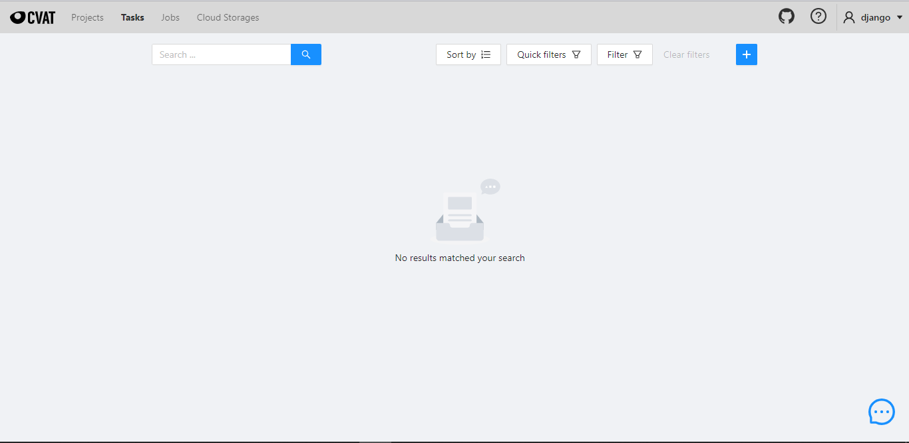

## How CVAT was set up
- I first installed WSL2 on my windows 10 computer. I followed the [official guide](https://docs.microsoft.com/windows/wsl/install-win10) to accomplish this.

- Next I installed the [Docker Desktop for windows](https://download.docker.com/win/stable/Docker%20Desktop%20Installer.exe) using [these instructions](https://docs.docker.com/docker-for-windows/install/).

- Next I installed Git for windows from [this location](https://github.com/git-for-windows/git/releases/download/v2.21.0.windows.1/Git-2.21.0-64-bit.exe)

- On git Bash, I ran the following command to clone the CVAT repository locally
	`git clone https://github.com/opencv/cvat`
	`cd cvat`

- Next I ran the following command to install it
	`docker-compose up -d`

I finally configured the superuser as follows:
	`winpty docker exec -it cvat_server bash -ic 'python3 ~/manage.py createsuperuser'`
	
## The Results
### Login page

### Dashboard

